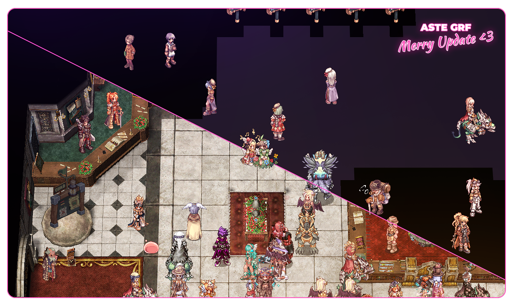

  

# About aste grf

Game modification file for the Ragnarok Online mmorpg game created for NovaRo private server [NovaRo private server](https://www.novaragnarok.com/).

## General info

Main purpose of this grf was to create clear, performance friendly woe grf with a maximum readability, so even people who only starting playing woe can have a clear understanding what is happening around them.
Even though it’s a woe grf at the first place, it’s still fully playable for pvm.

## Compiling the grf

- Download [tokei's grf editor](https://rathena.org/board/topic/77080-grf-grf-editor/).
- Put every file in the grf container using tokei's grf editor, starting tree structure from **data/..** so the end result would look like **grf/data/...**
- Put grf file in the your client folder **usually (C:\Program Files (x86)\NovaRO)**.
- Open your **data.ini** file with any text editor tool (notepad for example). Add a new line after jobsprites.grf and before maps.grf with a number 3 in it. Change all numbers in the list so files would be numbered from 0 to 8. Save.

## MH2 Graymap

Due to the encryption of mh2 graymap it can't be shared here in github, but if you still want to have it, you can use this clear grf with encrypted mh2 map as a base and build your own version of grf upon it [aste-grf-mh2-clear-base](https://github.com/asteanya/grf/releases/download/v2/aste-grf-mh2-clear-base.grf).

## Special thanks

**Aste 2021:**

I really glad to see someone as inspired as me continuing my work.
I think our goal of making players gaming experience better is cleary can be read through whole grf, so i hope you will enjoy it.

Thank you, **Merry**.

**Merry 2021:**

Special thanks to...
Dudu
Caul
Azad
Ila
Soup
Diversity
...for helping me make, test, and improve various aspects of this grf by providing feedback.

Shoutouts to...
Acid
Akinya
Cyanidex
Ducky
Daniel
Rino
...for being amazing people who help keep me sane and deal with my antics on a regular basis.

And finally, huge, huge thanks to Aste for originally starting the base of this amazing grf!

**Aste 2019**

Shoutouts to:

- Korea
- Enya
- Ara
- Kumanjo
- Nik
- Shalltear
- Kiki Do You Love Me
- Dika
- Mandie
- Hooten
- Cadu
- Puny
- Kendall

I want to say special thanks to person who made this grf possible:
- Midnight

Also a huge shoutout to Tokei, the genious person who created an amazing tools for working on ragnarok stuff. It’s inspiring.

Huge love for my fellow 49 people, you are the best, i love you all <3

- Dede
- Flous
- Tina
- Zofe
- Ayaya aka AkiDuck
- Perfect Ex
- Diversity
- Diyosa
- Gab
- Misa
- Koen
- Mew
- Pori
- Acid

For everyone who participated in the beta test, your help was enormous, this grf ended up this great only because of you. Thank you.
Thanks to Nova and all NovaRo staff members for everything that you doing for us.
